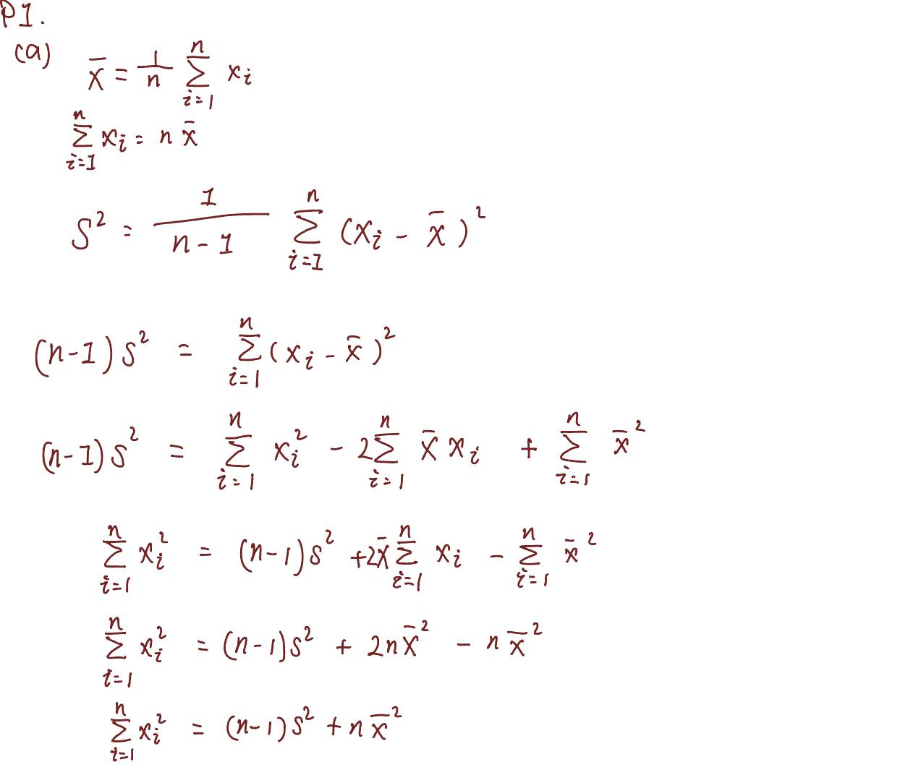
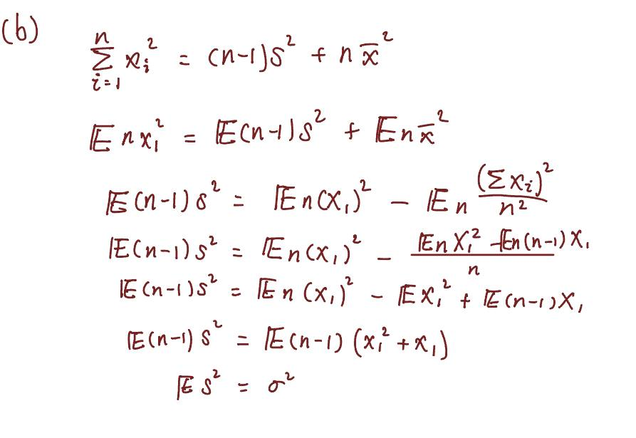
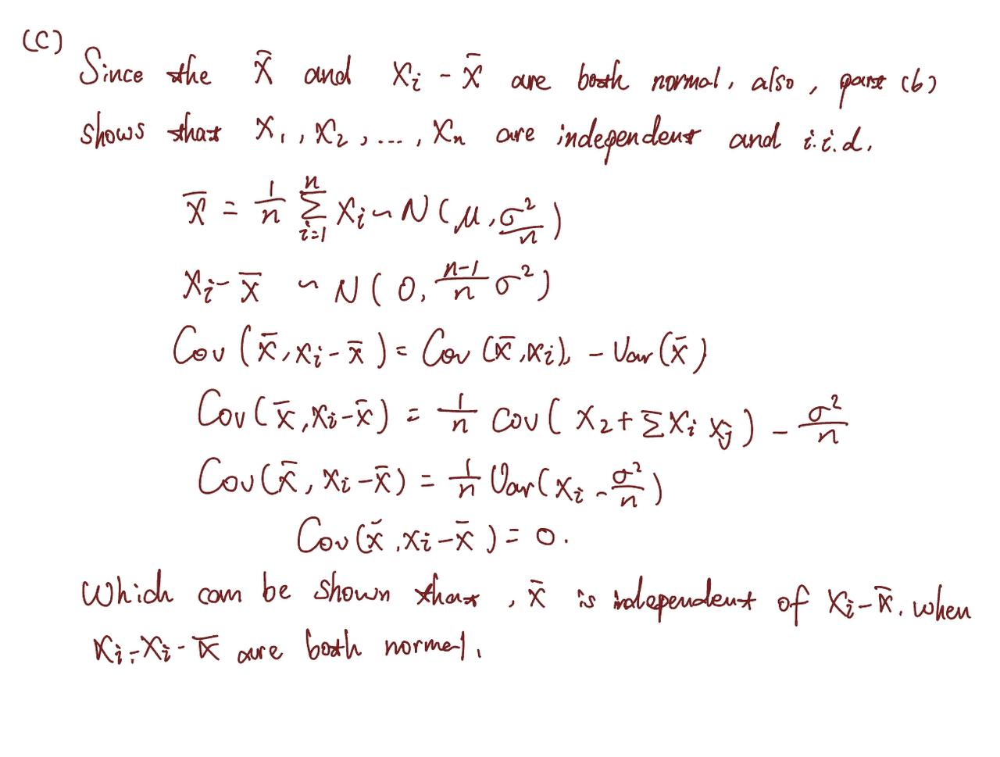
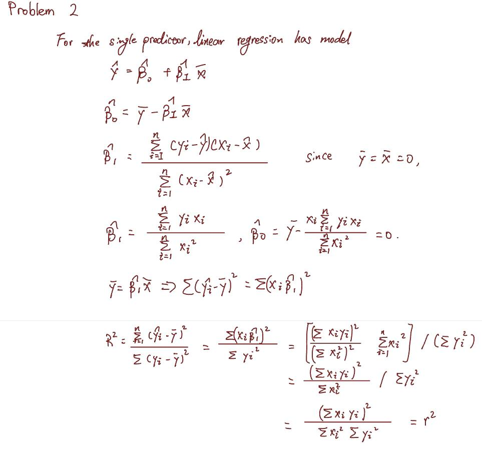
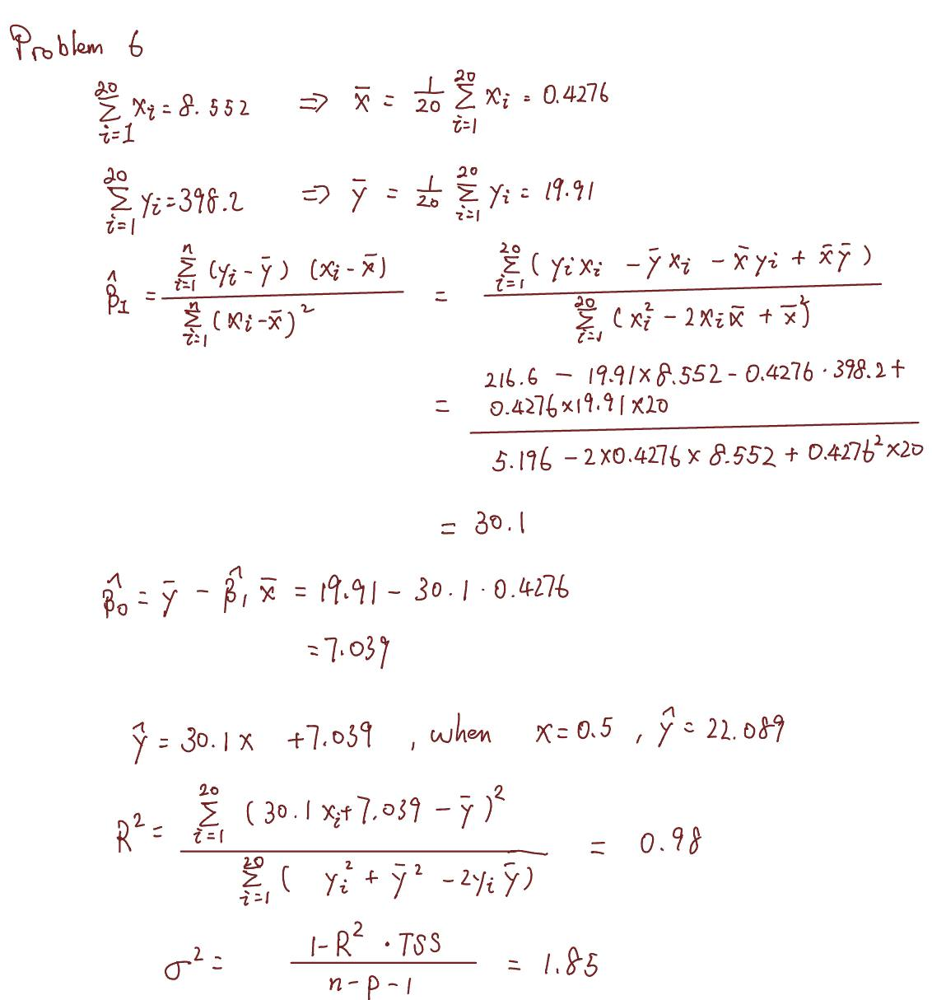

```{r setup, include=FALSE}
knitr::opts_chunk$set(echo = TRUE)
```

# Problem 1
## (a)

For the first given equation, it can be re-written as:

```{=latex}
$$\overline X = \frac 1 n \sum_{i=1}^n X_i$$
$$\sum_{i=1}^n X_i = n \overline X$$
```

Then for the second given equation:
```{=latex}
$$S^2 = \frac 1 {n-1} \sum_{i=1}^n (X_i-\overline X)^2$$
$$(n-1)S^2 = \sum_{i=1}^n (X_i-\overline X)^2$$
$$(n-1)S^2 = \sum_{i=1}^n X_i^2 - 2\sum_{i=1}^n \overline X X_i + \sum_{i=1}^n \overline X^2$$
$$\sum_{i=1}^n X_i^2 = (n-1)s^2 + 2\overline X \sum_{i=1}^n X_i - \sum_{i=1}^n \overline X^2$$
$$\sum_{i=1}^n X_i^2 = (n-1)s^2 + 2n\overline X^2 - n\overline X^2$$
$$\sum_{i=1}^n X_i^2 = (n-1)s^2+n\overline X^2$$
```

```{r, fig.cap="Problem 1(a) solution", out.width = '100%'}

```

## (b)
Since the answer from (a) shows that

```{=latex}
$$\sum_{i=1}^n X_i^2 = (n-1)S^2+n\overline X^2$$
```
then it can be calculated:

```{=latex}
$$\mathbb E nX_1^2 = \mathbb E (n-1)S^2+\mathbb E n\overline X^2$$
$$\mathbb E (n-1)S^2 = \mathbb E n X_1^2 - \mathbb E n \frac {(\sum_{i=1}^n X_i)^2} {n_2}$$
$$\mathbb E (n-1)S^2 = \mathbb E n X_1^2 - \mathbb E X_1^2 + \mathbb (n-1)X_1$$
$$\mathbb E (n-1)S^2 = \mathbb E (n-1) (X_1^2+X_1)$$
$$\mathbb E S^2 = \sigma ^2 $$
```

```{r, fig.cap="Problem 1(b) solution", out.width = '100%'}

```

## (c)
Since the $\overline X$ and $X_i-\overline X$ are normal, and results from (b), can deduce that:
```{=latex}
$$ \overline X = 1/n \sum_{i=1}^n X_i \sim \mathbb N (\mu, \sigma ^2/n)$$
$$ X_i - \overline X \sim\mathbb N (0,((n-1)/n)\sigma^2)$$
$$ Cov(\overline X, X_i-\overline X) = Cov(\overline X, X_i)-Var(\overline X)$$
```

```{r, fig.cap="Problem 1(c) solution", out.width = '100%'}

```

## (d)

Since the solution of 1(a) prove that 
$$\sum_{i=1}^n X_i^2 = (n-1)s^2+n\overline X^2$$
In 1(b) it proves that $X_i^2-\overline X^2$ is independent of the $\overline X$, so the $\overline X$ should also independent to $S^2$

# Problem 2

Solution for problem 2
```{r, fig.cap="Problem 2 solution", out.width = '100%'}

```


# Problem 3
## (a)
```{r x}
set.seed(1)
x <- rnorm(100)
```
## (b)
```{r eps}
eps <- rnorm(100, 0, sqrt(0.25))
```
## (c)
``` {r y}
y <- -1 + 0.5*x +eps
length(y)
```
## (d)
```{r}
plot(xlab="x", ylab="y", x, y)
```
It shows the relationship regarding to y and x, which should be a linear function.

## (e)
```{r}
summary(lm(y~x))
```
The original coefficient $\beta_0$ and $\beta_1$ is -1 and 0.5The new $\hat\beta_0$ is $-1.01885$, $\hat\beta_1$ is $0.49947$. The p-value is $4.853e^{-15}$, which is under the threshold value 0.05, so in this case the null hypothesis is more likely to be rejected.

## (f)
``` {r}
plot(x, y)
abline(lm(y~x), col="red")
abline(-1, 0.5, col="green")
legend(0, -2, legend = c("linear regression line", "population regression line"), 
       col=c("red","green"),lwd=1:2)
```

## (g)
```{r}
summary(lm(y~x+I(x^2)))
```
The R-squared has an increase than before, so it can be seen as the fit has been improved after adding the quadratic term.

## (h)

```{r}
set.seed(1)
x_ln <- rnorm(100)
# change variable to 0.1, less noise
eps_ln <- rnorm(100, 0, 0.1)
y_ln <- -1 + 0.5*x_ln +eps_ln
length(y_ln)
plot(xlab="x", ylab="y", x_ln, y_ln)
summary(lm(y_ln~x_ln))
plot(x_ln, y_ln)
abline(lm(y_ln~x_ln), col="red")
abline(-1, 0.5, col="green")
legend(0.5, -1.75
       , legend = c("linear regression line", "population regression line"), 
       col=c("red","green"),lwd=1:2)
```
By changing the variance of the normal distribution to generate noise from $0.5$ to $0.1$, the Residual standard error has been decreased to $0.09628$, and the $R^2$ increased to $0.9565$. And the fitting graph shows that the regression line is more fit to the scattered points. These indicate that the model has less noise and the model is more fit.

## (i)
```{r}
set.seed(1)
x_mn <- rnorm(100)
# change variable to 1.5, make noisier
eps_mn <- rnorm(100, 0, 1.5)
y_mn <- -1 + 0.5*x_mn +eps_mn
length(y_mn)
plot(xlab="x", ylab="y", x_mn, y_mn)
summary(lm(y_mn~x_mn))
plot(x_mn, y_mn)
abline(lm(y_mn~x_mn), col="red")
abline(-1, 0.5, col="green")
legend(0.5, -3, legend = c("linear regression line", "population regression line"), 
       col=c("red","green"),lwd=1:2)
```
By changing the noise variance to 1.5, the Residual standard error increased to 1.444, and the $R^2$ decreased to 0.08849. For the diagram, the regression line is more flat and most part of scattered point are not fitted well. These indicate that this model has more noise which results the not well fit.

## (j)
```{r}
# original data set
confint(lm(y~x), level=0.95)
# less noisy data set
confint(lm(y_ln~x_ln), level=0.95)
# noisier data set
confint(lm(y_mn~x_mn), level=0.95)
```
The less noise that the model has, the interval will be more narrow. For example, with the less noisy data set has more close to the original $\beta_0$ and $\beta_1$, and the noisier data set has bigger difference.

# Problem 4

###  Sales onto newspaper
```{r}
Advertising <- read.csv("./src/Advertising.csv",sep=',') 
str(Advertising)
#Sales onto Newspaper
lm.sales_newspaper <- lm(Advertising$sales~Advertising$newspaper)
summary(lm.sales_newspaper)
plot(Advertising$newspaper, Advertising$sales, xlab = "newspaper", ylab = "sales" )
abline(lm.sales_newspaper, col="red")
confint(lm.sales_newspaper, level=0.92)
abline(coef=confint(lm.sales_newspaper, level=0.92)[,1], col="green")
abline(coef=confint(lm.sales_newspaper, level=0.92)[,2], col="blue")
legend(75, 8, legend = c("linear regression line", "4%", "96%"), 
       col=c("red","green", "blue"),lwd=1:2)
```

### Sales onto TV
```{r}
#Sales onto TV
lm.sales_TV <- lm(Advertising$sales~Advertising$TV)
summary(lm.sales_TV)
plot(Advertising$TV, Advertising$sales, xlab = "TV", ylab = "sales" )
abline(lm.sales_TV, col="red")
confint(lm.sales_TV, level=0.92)
abline(coef=confint(lm.sales_TV, level=0.92)[,1], col="green")
abline(coef=confint(lm.sales_TV, level=0.92)[,2], col="blue")
legend(180, 8, legend = c("linear regression line", "4%", "96%"), 
       col=c("red","green", "blue"),lwd=1:2)
```

### Sales onto radio
```{r}
str(Advertising)
#Sales onto radio
lm.sales_radio <- lm(Advertising$sales~Advertising$radio)
summary(lm.sales_radio)
plot(Advertising$radio, Advertising$sales, xlab = "radio", ylab = "sales" )
abline(lm.sales_radio, col="red")
confint(lm.sales_radio, level=0.92)
abline(coef=confint(lm.sales_radio, level=0.92)[,1], col="green")
abline(coef=confint(lm.sales_radio, level=0.92)[,2], col="blue")
legend(30, 8, legend = c("linear regression line", "4%", "96%"), 
       col=c("red","green", "blue"),lwd=1:2)
```

# Problem 5
## (a)
```{r}
Auto <- read.csv("./src/Auto.csv",sep=',') 
str(Auto)
```
```{r}
#head(Auto)
Auto[,4] = as.numeric(factor(Auto[,4]))
Auto[,9] = as.numeric(factor(Auto[,9]))
pairs(Auto[,1:9])
```

## (b)
```{r}
cor(Auto[1:8])
```

## (c)
```{r}
lm(mpg~.-name, data=Auto)
summary(lm(mpg~.-name, data=Auto))
```
### i
Since the p-value is smaller than the threshold value 0.05, so the null hypothesis should be rejected. So it can be said that there is a relationship between the predictors and the response.

### ii
The displacement, weight, acceleration, year and origin have a statistically significant relationship to the response.

### iii
It suggests that in each year, the mpg will increase 0.77, which implies that the horse power will increase and the cylinders will decrease in each year.

## (d)
```{r}
lm.fit_5d = lm(sqrt(Auto$mpg)~log(Auto$cylinders)+sqrt(Auto$displacement)+
                 (Auto$horsepower^2)+log(Auto$weight)+sqrt(Auto$acceleration)+
                 (Auto$year)+(Auto$origin^2))
summary(lm.fit_5d)
```
From the data, null hypothesis should be rejected, since the p-value is smaller than the threshold value 0.05. The residual standard error decreased and $R^2$ has a slightly increase.

# Problem 6
$$ \overline x = \frac 1 {20} \sum_{i=1}^{20} x_i = 0.4276 $$
$$ \overline y = \frac1 {20} \sum_{i=1}^{20} y_i = 19.91 $$
$$ \hat\beta_1 = \frac {\sum_{i=1}^{20} (y_i-\overline y)(x_i - \overline x)} {\sum_{i=1}^{20}(x_i-\overline x)^2}$$
$$ \hat\beta_1 =  \frac {\sum_{i=1}^{20}(y_ix_i-\overline y x_i-\overline xy_i + \overline x \overline y)} {\sum_{i=1}^{20}(x_i^2-2x_i\overline x+\overline x^2)}$$
$$ \hat\beta_1 =  \frac {\sum_{i=1}^{20}y_ix_i - \overline y\sum_{i=1}^{20} x_i - \overline x\sum_{i=1}^{20}  y_i + \overline x \overline y} {\sum_{i=1}^{20} x_i^2 - \overline x\sum_{i=1}^{20}2x_i + \overline x^2}$$
$$ \hat\beta_1 =  \frac {216.6-398.2*0.4276-19.91*8.552+19.91*0.4276*20} {5.196+0.4276^2*20-2*8.552*0.4276}$$
$$ \hat\beta_1 = 30.1 $$
$$ \hat\beta_0  = \overline y - \hat\beta_1 \overline x = 19.91-30.1*0.4276 = 7.039$$
So, $$\hat y = 30.1x+7.039 $$, and when $x = 0.5$, $$\hat y = 22.089$$
$$R^2 = \frac {\sum_{i=1}^{20}(30.1x_i+7.039-\overline y)^2}{\sum_{i=1}^{20}(y_i^2+\overline y^2-2y_i\overline y)}=0.98$$
$$\sigma^2 = \frac {1-R^2*TSS} {n-p-1} = 1.85$$

```{r, fig.cap="Problem 6 solution", out.width = '100%'}

```

\newpage

# Problem 7
If the model accept the null hypothesis, then the equation is
$$\frac {TSS-RSS} {p} / \frac{RSS}{n-p-1}=\frac {11.62-8.95}{6} / \frac {8.95}{45-6-1} = 1.889$$
```{r}
pf(1.889, 6, 38, lower.tail=FALSE)
```
p-value is 0.1080044