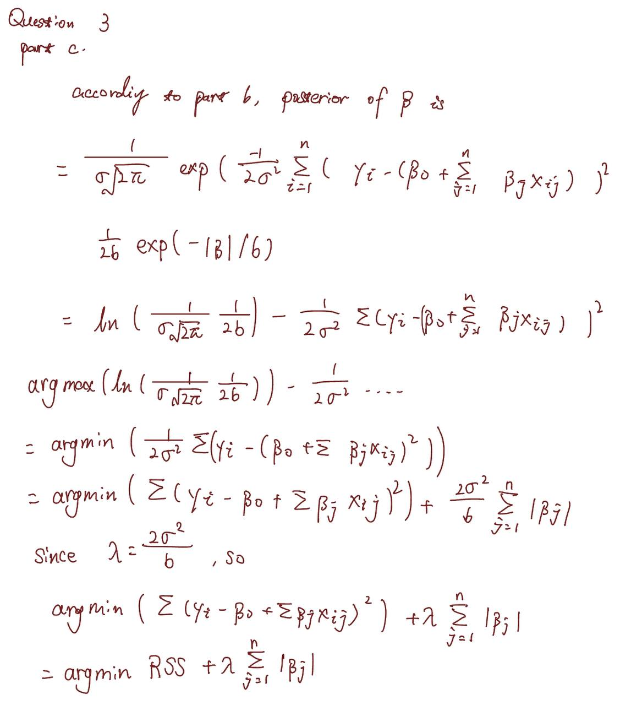
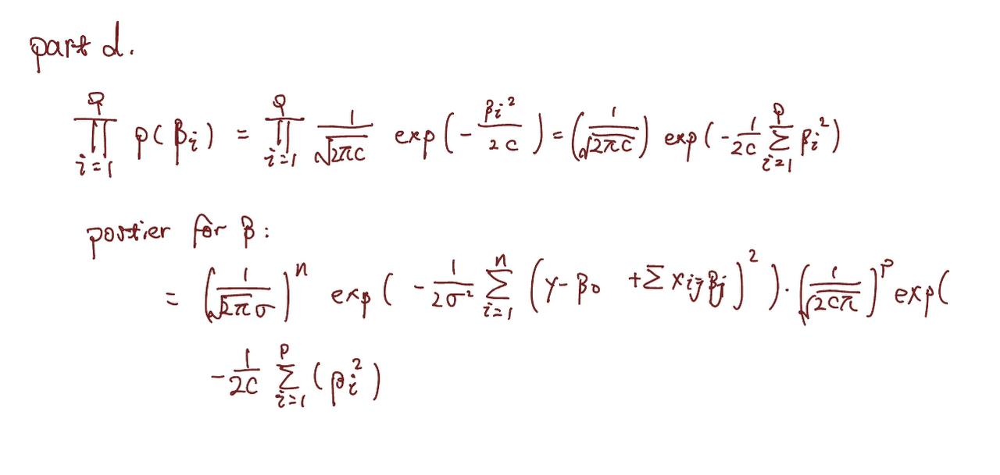
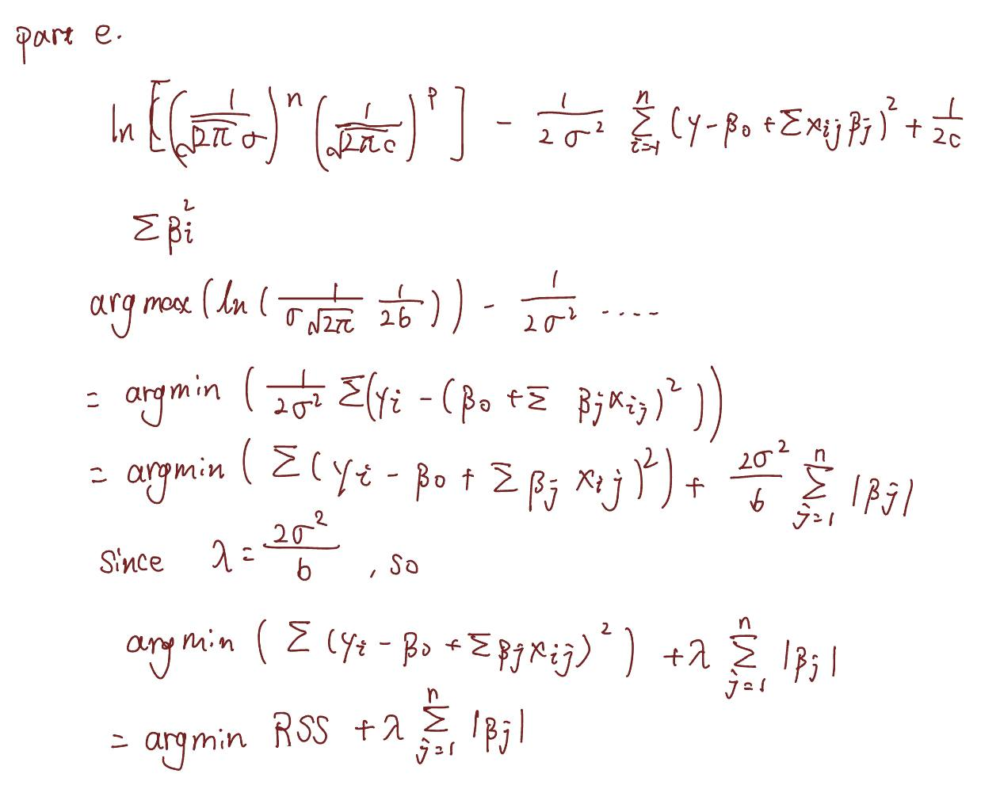

```{r setup, include=FALSE}
knitr::opts_chunk$set(echo = TRUE)
```

# Problem 1

## Part a
The ridge regression can be written as the following:
$$min\ (RSS + \lambda \sum_{j=1}^p\beta^2_j)$$
Where RSS could written as the following:
$$RSS=\sum_{i=1}^n(y_i-\beta_0-\sum_{j=1}^p\beta_jx_{ij})^2$$
Where according to the problem, $n=2, \ \ p=2,\ \  \hat\beta_0=0$, so the final form of ridge regression can be written as below:
$$min\ (\sum_{i=1}^2(y_i-\sum_{j=1}^2\beta_jx_{ij})^2+ \lambda \sum_{j=1}^2\beta^2_j$$
$$min\ (y_1-\hat\beta_1x_{11}-\hat\beta_2x_{12})^2+(y_2-\hat\beta_1x_{21}-\hat\beta_2x_{22})^2+\lambda(\hat\beta_1^2+\hat\beta_2^2)$$

## Part b
According to the problem, $x_{11}=x_{12},\ x_{21}=x_{22},\ y_1+y_2=0,\ x_{11}+x_{21}=0,\ x_{12}+x_{22}=0$
$$\beta_1 = \frac {x_1y_1+x_2y_2-\beta_2(x_1^2+x_2^2)} {\lambda+x_1^2+x_2^2}$$
$$\beta_2 = \frac {x_1y_1+x_2y_2-\beta_2(x_1^2+x_2^2)} {\lambda+x_1^2+x_2^2}$$
$$\beta_1 = \beta_2$$

## Part c
Lasso optimisation:
$$min\ (RSS+\lambda\sum_{j=1}^p|\beta_j|)$$
$$min\ (\sum_{i=1}^2(y_i-\sum_{j=1}^2\beta_jx_{ij})^2+\lambda(|\hat\beta_1|+|\hat\lambda_2|))$$
$$min\ (y_1-\hat\beta_1x_{11}-\hat\beta_2x_{12})^2+(y_2-\hat\beta_1x_{21}-\hat\beta_2x_{22})^2+\lambda(|\hat\beta_1^2|+|\hat\beta_2^2|)$$

## Part d
The best subset for lasso is:
$$|\beta_1|+|\beta_2|\le s$$
According to the problem, $x_{11}=x_{12},\ x_{21}=x_{22},\ y_1+y_2=0,\ x_{11}+x_{21}=0,\ x_{12}+x_{22}=0$
So the answer in part c can be minimized as following:
$$min\ 2(y_1-(\hat\beta_1+\hat\beta_2)x_{11})^2$$
Where the minimum is that $y_1-(\hat\beta_1+\hat\beta_2)x_{11}=0$, where $\frac {y_1} {x_{11}}=\hat\beta_1+\hat\beta_2$
Since the minimum are at the same gradient as the best subset, $\beta_1+\beta_2=s$.So two solutions can be determined in here:
$$\hat\beta_1+\hat\beta_2=s$$
$$\hat\beta_1+\hat\beta_2=-s$$

# Problem 2

## Part a
For p=1, the equation 1 should be:
$$(y-\beta_1)^2+\lambda\beta_1^2=(1+\lambda)\beta_1^2-2y\beta_1+y^2$$
Where $\hat\beta_1=y_1/(1+\lambda)$
So $(1+\lambda)-2y\beta_1+y^2)'=(1+\lambda)\beta_1-2y_1=0$
Set y and lambda are both 3.
```{r}
y <- 3
lambda <- 3
beta1<- seq(-20, 20, 0.01)
fun <- (y-beta1)^2+lambda*beta1^2
fun2 <- (y) / (1+lambda)
fun3 <- (y-fun2)^2+lambda*fun2^2
plot(beta1, fun, type="l", xlab = "beta1", ylab = "function", xlim=c(-1,2.5), 
     ylim=c(5,20))
points(fun2, fun3, col="blue", lwd=5)
```
Where the blue dot is the minimum value for the function by $\beta_1$, which should same as the value of $\hat\beta_1=y_1/(1+\lambda)=3/(1+3)=0.75$

## Part b
For p=1, equation 2 can be written as:
$$(y-\beta_1)^2+\lambda|\beta_1|$$
Which can be re-written as:
$$(y-\beta_1)^2+\lambda\beta_1$$
$$(y-\beta_1)^2-\lambda\beta_1$$
Assume $y=3, \ \ \lambda=3$,
```{r}
y <- 3
lambda <- 3
beta1 <- seq(-20, 20, 0.01)
fun <- (y-beta1)^2+lambda*abs(beta1)
fun2 <- y-lambda/2
fun3 <- (y-fun2)^2+lambda*abs(fun2)
plot(beta1, fun, type="l", xlab = "beta1", ylab = "function", xlim=c(-2,5), 
     ylim=c(5,20))
points(fun2, fun3, col="blue", lwd=5)
```
Where the blue dot shows the minimum value of the function by $\beta_1$, which should be same as the result of the function:
$$\beta_1=y-\frac \lambda 2=3-\frac 3 2=1.5$$

# Question 3

## Part a
Where likelihood of the data which distributed from $\mathbf N(0,\sigma^2)$ distribution for $y_i$ can be written as:
$$\prod_{i=1}^n\frac 1 {\sigma\sqrt {2\pi} exp(\frac {-(y_i-(\beta_0+\sum_{j=1}^n\beta_jx_{ij}))^2} {2\sigma^2})}$$
$$\frac 1 {\sigma\sqrt {2\pi} } exp(\frac {-1} {2\sigma^2} \sum_{i=1}^n(y_i-(\beta_0+\sum_{j=1}^{n} \beta_jx_{ij}))^2)$$

## Part b
For $p(\beta)=\frac 1 {2b} exp(-|\beta|/b)$ and $|\beta|=\sum_{j=1}^p|\beta_j|$, the likelihodd function can be written from the answer in part a:
$$\frac 1 {\sigma\sqrt {2\pi} } exp(\frac {-1} {2\sigma^2} \sum_{i=1}^n(y_i-(\beta_0+\sum_{j=1}^{n} \beta_jx_{ij}))^2)\frac 1 {2b}exp(-|\beta|/b)$$


## Part c

```{r, fig.cap="Problem 3 Part c solution", out.width = '100%'}

```

## Part d

```{r, fig.cap="Problem 3 Part d solution", out.width = '100%'}

```


## Part e

```{r, fig.cap="Problem 3 Part e solution", out.width = '100%'}

```
\newpage

# Question 4

## Part a
```{r}
set.seed(1)
x <- rnorm(100)
epsilon <- rnorm(100)
```

## Part b
```{r}
beta0 <- 11
beta1 <- 4
beta2 <- 5
beta3 <- 14
y <- beta0 + beta1*x + beta2*x^2 + beta3*x^3 + epsilon
```

## Part c
```{r}
# produce data set
data_set1 <- data.frame(y=y, x=x)
# import leaps lib for regsubsets
library(leaps)
# to produce model for 15 predicted points
best_model1 <- regsubsets(y ~ poly(x, 10, raw=TRUE), data = data_set1, 
                          nvmax = 15)
summary1 <- summary(best_model1)
which.min(summary1$bic)
which.min(summary1$cp)
which.min(summary1$adjr2)
# show diagrams for bic, cp and adjr2
plot(summary1$bic, type = "b", pch=19, cex.lab=2, ylab="bic")
points(3, summary1$bic[3], col = "red",lwd=5)
title("bic")
plot(summary1$cp, type = "b", pch=19, cex.lab=2, ylab="cp")
points(4, summary1$cp[4], col = "blue",lwd=5)
title("cp")
plot(summary1$adjr2, type = "b", pch=19, cex.lab=2, ylab = "adjr2")
points(1, summary1$adjr2[1], col = "blue",lwd=5)
title("adjr2")
# generate hat beta 1 to 3
coefficients(best_model1, id=3)
```
Where $\hat\beta_0=11.061507,\ \ \hat\beta_1=3.975280, \ \ \hat\beta_2=4.876209, \ \ \hat\beta_3=14.017639$. According to the assumption $\beta_0=11,\ \ \beta_1=4, \ \ \beta_2=5, \ \ \beta_3=14$, can be found that:
$$|\hat\beta_0-\beta_0|=0.061507,\ \ |\hat\beta_1-beta_1|=0.02472, \ \ |\hat\beta_2-beta_2|=0.123791, \ \ |\hat\beta_3-\beta_3|=0.017639$$

## Part d
```{r}
# For forward stepwise selection
best_model1_forward <- regsubsets(y ~ poly(x, 10, raw=TRUE), data = data_set1, 
                                  nvmax = 15, method="forward")
summary1_forward <- summary(best_model1_forward)
which.min(summary1_forward$bic)
which.min(summary1_forward$cp)
which.min(summary1_forward$adjr2)
# show diagrams for bic, cp and adjr2
plot(summary1_forward$bic, type = "b", pch=19, cex.lab=2, ylab="bic")
points(3, summary1_forward$bic[3], col = "red",lwd=5)
title("bic")
plot(summary1_forward$cp, type = "b", pch=19, cex.lab=2, ylab="cp")
points(4, summary1_forward$cp[4], col = "blue",lwd=5)
title("cp")
plot(summary1_forward$adjr2, type = "b", pch=19, cex.lab=2, ylab = "adjr2")
points(1, summary1_forward$adjr2[1], col = "blue",lwd=5)
title("adjr2")
# generate hat beta 1 to 3
coefficients(best_model1_forward, id=3)
```
The output for the forward stepwise selection method, the coefficient for $\hat\beta_0, \ \ \hat\beta_1, \ \ \hat\beta_2, \ \ \hat\beta_3$ are nearly the same.

```{r}
# For backward stepwise selection
best_model1_backward <- regsubsets(y ~ poly(x, 10, raw=TRUE), data = data_set1, 
                                   nvmax = 15, method="backward")
summary1_backward <- summary(best_model1_backward)
which.min(summary1_backward$bic)
which.min(summary1_backward$cp)
which.min(summary1_backward$adjr2)
# show diagrams for bic, cp and adjr2
plot(summary1_backward$bic, type = "b", pch=19, cex.lab=2, ylab="bic")
points(3, summary1_backward$bic[3], col = "red",lwd=5)
title("bic")
plot(summary1_backward$cp, type = "b", pch=19, cex.lab=2, ylab="cp")
points(4, summary1_backward$cp[4], col = "blue",lwd=5)
title("cp")
plot(summary1_backward$adjr2, type = "b", pch=19, cex.lab=2, ylab = "adjr2")
points(1, summary1_backward$adjr2[1], col = "blue",lwd=5)
title("adjr2")
# generate hat beta 1 to 3
coefficients(best_model1_backward, id=3)
```
The output for the backward stepwise selection method, the coefficient for $\hat\beta_0, \ \ \hat\beta_1, \ \ \hat\beta_2, \ \ \hat\beta_3$ are also nearly the same.

## Part e
```{r}
x4e <- model.matrix(y ~ poly(x, 10, raw = TRUE), data = data_set1)[, -1]
library(glmnet)
lasso_model2 <- cv.glmnet(x4e, y)
plot(lasso_model2)
model_4e <- glmnet(x4e, y)
lasso_model2$lambda.min
predict(model_4e, s = lasso_model2$lambda.min, type = "coefficients")
```
In this approach, $\beta_1$ to $\beta_4$ will be selected.

## Part f
```{r}
# Y=beta0+beta7*x^7+epsilon
beta7 <- 15
y2 <- beta0+beta7*x^7+epsilon
dataset_4f <- data.frame(y = y2, x = x)
model_4f <- regsubsets(y ~ poly(x, 10, raw = TRUE), data = dataset_4f, nvmax = 15)
model_4f_summary <- summary(model_4f)
which.min(model_4f_summary$bic)
coefficients(model_4f, id=1)
which.min(model_4f_summary$cp)
coefficients(model_4f, id=2)
which.min(model_4f_summary$adjr2)
coefficients(model_4f, id=10)
```
```{r}
x_4f <- model.matrix(y ~ poly(x, 10, raw = TRUE), data = dataset_4f)[, -1]
lasso_model_4f <-cv.glmnet(x_4f, y2, alpha=1)
best_model_4f <- glmnet(x_4f, y2)
predict(best_model_4f, s=lasso_model_4f$lambda.min, type="coefficients")
```

# Question 5
## Part a
```{r}
library(ISLR)
set.seed(20)
training_set <-sample(1:nrow(College), nrow(College) / 1.25)
test_set <- -training_set
```

## Part b
```{r}
# Applications fitting
lm.fit <- lm(Apps~., data=College[training_set, ])
lm.pred <- predict(lm.fit, College[test_set, ])
mean((College[test_set, "Apps"] - lm.pred)^2)
```

## Part c
```{r}
training_matrix <- model.matrix(Apps~., data=College[training_set, ])
test_matrix <- model.matrix(Apps~., data=College[test_set, ])
grid <-10 ^ seq(4, -2, length=100)
ridge_5c <- cv.glmnet(training_matrix, College[training_set, "Apps"])
mean((College[test_set, "Apps"] - predict(ridge_5c, newx = test_matrix, s=ridge_5c$lambda.min))^2)
```
Where the test error here is higher.

## Part d
```{r}
lasso_5c <- cv.glmnet(training_matrix, College[training_set, "Apps"])
lambda_5c_min <-lasso_5c$lambda.min
mean((College[test_set, "Apps"]-predict(lasso_5c, newx = test_matrix, s=lambda_5c_min))^2)
model_5c <- glmnet(model.matrix(Apps~., data=College), College[, "Apps"], alpha=1)
predict(model_5c, s=lambda_5c_min, type="coefficients")
```
Where the test error has no has slightly decrease than part c.

# Question 6
## Part a
```{r}
set.seed(38)
p <- 20
n <- 1000
x <- matrix(rnorm(p*n), n, p)
# random for beta has 20 features
beta <- rnorm(20)
# random zero for random beta[]
beta[4] <- 0
beta[7] <- 0
beta[11] <- 0
beta[18] <- 0
# random epsilon has 20 features
epsilon <- rnorm(20)
y <- x%*%beta+epsilon
```

## Part b
```{r}
# 100 training set
training_set <- sample(seq(1000), 100)
test_set <- -training_set
x_training <- x[training_set, ]
y_training <- y[training_set, ]
x_test <- x[test_set, ]
y_test <- y[test_set, ]
```

## Part c
```{r}
a <- regsubsets(y~., data = data.frame(x=x_training, y=y_training), nvmax=20)
noise <- rep(NA, p)
x_ma <- colnames(x, prefix = "x.", do.NULL = FALSE)
# fit
coeff <- coef(a, id = 1)
prediction <- as.matrix(x_training[, (x_ma %in% names(coeff)) ]) %*% (coeff[names(coeff) %in% x_ma])
noise[1] <- mean((y_training - prediction)^2)
for (i in 2:20) {
  coeff <- coef(a, id = i)
  prediction <- as.matrix(x_training[, (x_ma %in% names(coeff)) ]) %*% (coeff[names(coeff) %in% x_ma])
  noise[i] <- mean((y_training - prediction)^2)
}
plot(noise, type = "b",pch=19)
```

## Part d
```{r}
a <- regsubsets(y~., data = data.frame(x=x_training, y=y_training), nvmax=20)
noise <- rep(NA, p)
x_ma <- colnames(x, prefix = "x.", do.NULL = FALSE)
# fit
for (i in 1:20) {
  coeff <- coef(a, id = i)
  prediction <- as.matrix(x_test[, (x_ma %in% names(coeff)) ]) %*% (coeff[names(coeff) %in% x_ma])
  noise[i] <- mean((y_test - prediction)^2)
}
plot(noise, type = "b",pch=19)
```

## Part e
```{r}
noise
which.min(noise)
noise[which.min(noise)]
```
Where the 19th model size is on the minimum value. Since is not an intercept or containing all features, so no need to repeat part a.

## Part f
``` {r}
coef(a, id=19)
```
The coefficient values are all different, where the biggest is x.13, and the smallest is x.10

## Part g

```{r}
a <- regsubsets(y~., data = data.frame(x=x_training, y=y_training), nvmax=20)
noise <- rep(NA, p)
x <- 0
y <- 0
x_ma <- colnames(x, prefix = "x.", do.NULL = FALSE)
for (i in 1:20) {
  coeff <- coef(a, id = i)
  x[i] <- sqrt(sum((beta[x_ma %in% names(coeff)] - coeff[names(coeff) %in% x_ma])^2))
  y[i] <- length(coeff)-1
  noise[i] <- mean((y_test - prediction)^2)
}
plot(x=y, y=x, type = "b",pch=19)
```
From the diagram, the error value is increase to non-zero since the 13th, then it continuesly increase, which has the reverse trend as diagram in part d.
