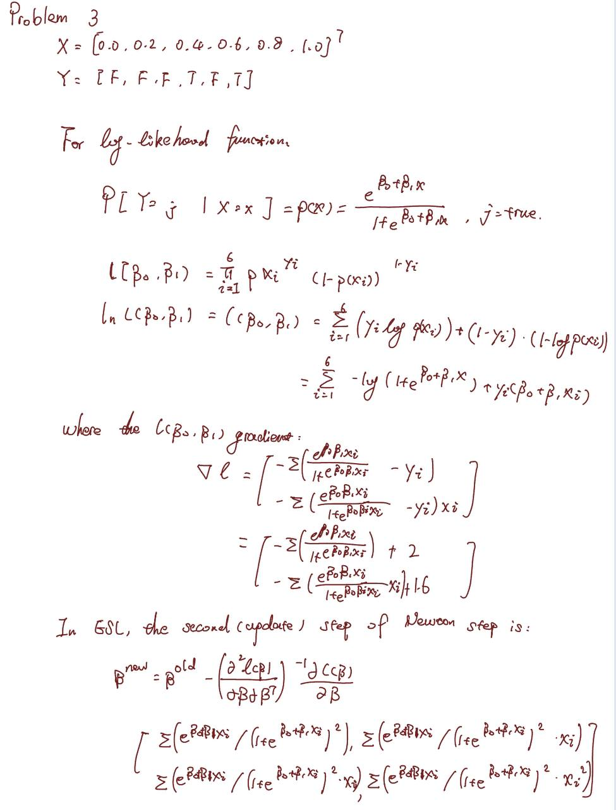
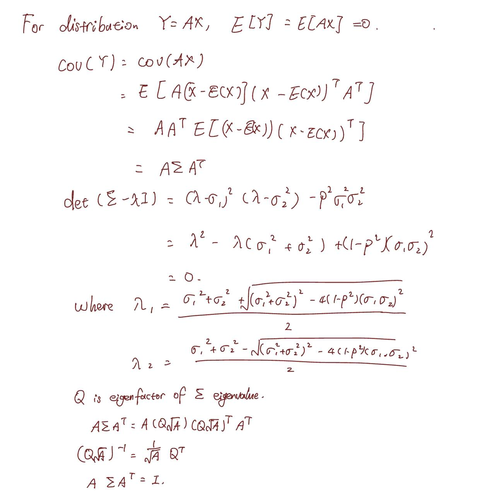
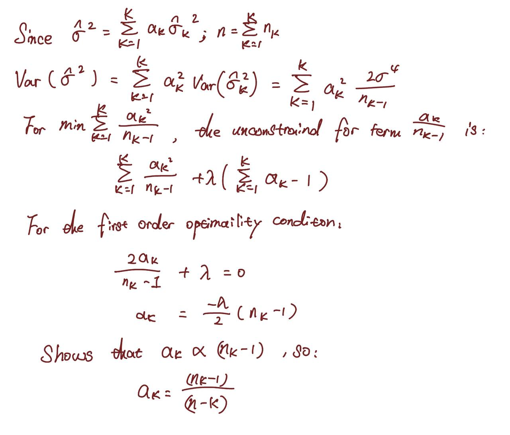

```{r setup, include=FALSE}
knitr::opts_chunk$set(echo = TRUE)
```

# Problem 1
## Part a
$$\hat p(x)=\frac {e^{-6+0.05x_1+x_2}} {1+e^{-6+0.05x_1+x_2}} \approx 0.378$$

## Part b
$$\hat p (X)=\frac {e^{-6+0.05x_1+x_2}} {1+e^{-6+0.05x_1+x_2}}=0.5$$
$$\hat p (X)=\frac {e^{-6+0.05x_1+3.5}} {1+e^{-6+0.05x_1+3.5}}=0.5$$
$$e^{-6+0.05x_1+3.5}=1$$
$$x_1=\frac {ln(1)-(-6)-3.5} {0.05}=50$$

#Problem 2
By using Bayes theorem, the equation can be written as:
$$p_1(4)=\frac {0.8e^{\frac {-(4-10)^2} {72}}} {0.8e^{\frac{-(4-10)^2}{72}}+0.2e^\frac{-(4-0)^2}{72}}\approx 0.75$$

# Problem 3
```{r, fig.cap="Problem 3 solution", out.width = '100%'}

```
\newpage

```{r}
library(matlib)
# For x and y
x <- c(0, 0.2, 0.4, 0.6, 0.8, 1.0)
y <- c(0, 0, 0, 1, 0, 1)
# For div_l
div_l <- function(beta) {
  m_1 <- sum( ((exp(beta[1] + beta[2]*x)) / (1 + exp(beta[1]+beta[2]*x))) - y )
  m_2 <- sum( (((exp(beta[1] + beta[2]*x)) / (1 + exp(beta[1]+beta[2]*x))) - y)*x )
  matrix(c(m_1,m_2),ncol=1,nrow = 2)
}
# For Newtown update matrix
newton_update <- function(beta) {
  mm_1 <- sum( (exp(beta[1] + beta[2]*x)) / (1 + exp(beta[1]+beta[2]*x))^2 )
  mm_2 <- sum( exp(beta[1] + beta[2]*x)*x / ((1 + exp(beta[1] + beta[2]*x))^2) )
  mm_3 <- sum( exp(beta[1] + beta[2]*x)*x / ((1 + exp(beta[1] + beta[2]*x))^2) )
  mm_4 <- sum( exp(beta[1] + beta[2]*x)*(x^2) / ((1 + exp(beta[1] + beta[2]*x))^2) )
  matrix(c(mm_1,mm_3,mm_2,mm_4),ncol = 2,nrow = 2)
}
beta <- c(-1, 1)
sprintf("Beta_0 = %s, Beta_1 = %s", beta[1], beta[2])
for(i in 1:10) {
  beta <- beta - inv(newton_update(beta))%*%div_l(beta)
  cat("For the iteration " , i, ", beta0 = ", beta[1], ", beta1 = ",beta[2], "\n")
}
model<-glm(y~x, family = "binomial")
sprintf("Beta_0= %s, Beta_1 = %s when using logistic regression",model$coefficients[1], model$coefficients[2])
```

# Problem 4
```{r, fig.cap="Problem 4 solution", out.width = '100%'}

```
\newpage

# Problem 5
```{r, fig.cap="Problem 5 solution", out.width = '100%'}

```
\newpage


# Problem 6
```{r}
samples <- c(0.1, 0.15, 0.2, 0.2, 0.55, 0.6, 0.6, 0.65, 0.7, 0.75)
# For majority vote approach
# Choose the majority probability sample
majority <- sum(samples > 1/2)
minority <- sum(samples < 1/2)
majority
minority
minority > majority
majority > minority
# For average probability
mean(samples)
```
So from the code, in the majority approach, the red probability, which is 0.6, is greater than the green probability, which is 0.4. So the classification result is red.
For the average probability approach, the mean of the sample probability is 0.45, which is smaller than 50%, so the classification result is green.

# Problem 7
## a
```{r}
library(ISLR)
attach(OJ)
set.seed(1000)
train <- sample(dim(OJ)[1], 800)
training_set <- OJ[train, ]
testing_set <- OJ[-train, ]
```

## b
```{r}
library(tree)
tree <- tree(formula = Purchase ~., data = training_set)
summary(tree)
```
The training error rate is 0.16, and the number of terminal node is 8. The result has mean deviance with 0.7486 and 3 variables are used in tree construction.

## c
```{r}
tree
```
For the node 'SpecialMM' with number 12, the split value is 2.125 and the 120 points below from this. 156.6 shows the deviance for points, is shows that the prediction is CH, where the 64.167% will be CH and another 35.833% is MM.

## d
```{r}
plot(tree)
text(tree)
```
From the tree diagram, can found that the variable 'LoyalCH' is most important. And for example, if the LoyalCH bigger than 0.764572, than the model predicts CH, and if PriceDiff < -0.35 the model precicts MM.

## e
```{r}
predict <- predict(tree, testing_set, type = "class")
table(testing_set$Purchase, predict)
```
Where the test error rate is $\frac {11+38} {150+11+38+71}=\frac {49} {270}=0.1815$

## f
```{r}
optimal_tree <- cv.tree(tree, FUN=prune.tree)
```

## g
```{r}
plot(optimal_tree$size, optimal_tree$dev, type = "b")
```

## h
Size 8 has lowest cross-validated classification error rate

## i
```{r}
pruned_tree <- prune.tree(tree, best = 8)
```

## j
```{r}
summary(tree)
summary(pruned_tree)
```
The error for the two tree is same.

## k
```{r}
# For pruned tree
predict_pruned = predict(pruned_tree, testing_set, type = "class")
sum(testing_set$Purchase != predict_pruned)/length(predict_pruned)

# For unpruned tree
sum(testing_set$Purchase != predict)/length(predict)
```
Where the test error rate of pruned and unpruned tree are the same.